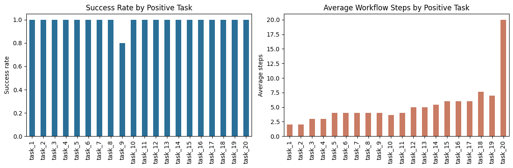

# 01. Benchmark: 25 Example Functions

### Note Metadata

- Date: 2026-03-15
- Status: draft

### Why This Note Exists

This note supports a narrow release-facing question: can `workflow_auto_assembler` assemble simple linear workflows from typed tool schemas and refuse tasks that require missing capabilities?

It should be read as a release-supporting research note, not as a formal research paper.


## Intro

### Claim

When tools are exposed through explicit input and output schemas, an LLM can often synthesize a correct simple linear workflow by stacking those tools into a larger typed procedure, while also rejecting tasks that require missing capabilities.


## Methodology

### Setup

The benchmark is defined in `artifacts/workflow_auto_assembler/examples/test_examples.py` and executed by `artifacts/workflow_auto_assembler/examples/run_benchmark.py`.

The system under test is `workflow_auto_assembler` operating over a fixed synthetic tool catalog. The benchmark contains `25` task specifications and `5` repeated runs per task, for `125` total runs.

The stored runs were executed with the `gpt-oss:20b` model through the benchmark harness configuration.

### Data / Cases

Tasks `1` to `20` are intended to be solvable with the available tools. They cover single-step actions, short multi-step chains, and larger linear compositions that require non-trivial field matching between tool outputs and downstream inputs.

Tasks `21` to `25` are intentionally unsupported and require capabilities absent from the tool catalog: database write-back, OCR, embeddings/vector indexing, contract compliance analysis, and crypto transfer execution.

### Method

The benchmark uses a synthetic catalog of `24` typed tools defined in `artifacts/workflow_auto_assembler/examples/functions.py`.

Planning is treated as a schema-matching problem: identify a linear sequence of tool calls whose outputs satisfy downstream inputs and eventually satisfy the requested output model.

Success is evaluated at two levels: whether a workflow can be assembled and completed, and whether the completed workflow passes the runner-based benchmark cases attached to the task.

### Limitations

The tools are synthetic and mostly deterministic. External side effects are mocked rather than executed against live services. The benchmark does not provide a controlled analysis of token usage, cost, or latency. The workflows are mostly linear and do not yet stress branching, loops, or persistent state.


## Analysis

### Results

The headline metrics below summarize aggregate run-level performance before breaking the benchmark into intended positive tasks and intentionally unsupported tasks.


```python

```


<div>
<style scoped>
    .dataframe tbody tr th:only-of-type {
        vertical-align: middle;
    }

    .dataframe tbody tr th {
        vertical-align: top;
    }

    .dataframe thead th {
        text-align: right;
    }
</style>
<table border="1" class="dataframe">
  <thead>
    <tr style="text-align: right;">
      <th></th>
      <th>metric</th>
      <th>value</th>
    </tr>
  </thead>
  <tbody>
    <tr>
      <th>0</th>
      <td>Total runs</td>
      <td>125.0000</td>
    </tr>
    <tr>
      <th>1</th>
      <td>Completed runs</td>
      <td>99.0000</td>
    </tr>
    <tr>
      <th>2</th>
      <td>Run-level success rate</td>
      <td>0.7920</td>
    </tr>
    <tr>
      <th>3</th>
      <td>Solved task types</td>
      <td>20.0000</td>
    </tr>
    <tr>
      <th>4</th>
      <td>Completed test pass rate</td>
      <td>1.0000</td>
    </tr>
    <tr>
      <th>5</th>
      <td>Average test retries</td>
      <td>0.0480</td>
    </tr>
    <tr>
      <th>6</th>
      <td>Average workflow steps</td>
      <td>5.2929</td>
    </tr>
    <tr>
      <th>7</th>
      <td>Distinct tools used</td>
      <td>24.0000</td>
    </tr>
  </tbody>
</table>
</div>


At the run level, the stored benchmark produced `99 / 125` completed workflows. At the task level, all `20` intended positive tasks were solved at least once. Among completed workflows, the benchmark records `990 / 990` passing benchmark cases.

Those aggregate numbers are useful, but the more informative split is between intended positive tasks and intentionally unsupported tasks.


```python

```


<div>
<style scoped>
    .dataframe tbody tr th:only-of-type {
        vertical-align: middle;
    }

    .dataframe tbody tr th {
        vertical-align: top;
    }

    .dataframe thead th {
        text-align: right;
    }
</style>
<table border="1" class="dataframe">
  <thead>
    <tr style="text-align: right;">
      <th></th>
      <th>runs</th>
      <th>completed</th>
      <th>possible</th>
      <th>success_rate</th>
      <th>test_pass_rate</th>
      <th>avg_test_retries</th>
      <th>avg_workflow_steps</th>
    </tr>
    <tr>
      <th>task_id</th>
      <th></th>
      <th></th>
      <th></th>
      <th></th>
      <th></th>
      <th></th>
      <th></th>
    </tr>
  </thead>
  <tbody>
    <tr>
      <th>task_1</th>
      <td>5</td>
      <td>5</td>
      <td>5</td>
      <td>1.0</td>
      <td>1.0</td>
      <td>0.0</td>
      <td>2.0</td>
    </tr>
    <tr>
      <th>task_2</th>
      <td>5</td>
      <td>5</td>
      <td>5</td>
      <td>1.0</td>
      <td>1.0</td>
      <td>0.0</td>
      <td>2.0</td>
    </tr>
    <tr>
      <th>task_3</th>
      <td>5</td>
      <td>5</td>
      <td>5</td>
      <td>1.0</td>
      <td>1.0</td>
      <td>0.0</td>
      <td>3.0</td>
    </tr>
    <tr>
      <th>task_4</th>
      <td>5</td>
      <td>5</td>
      <td>5</td>
      <td>1.0</td>
      <td>1.0</td>
      <td>0.0</td>
      <td>3.0</td>
    </tr>
    <tr>
      <th>task_5</th>
      <td>5</td>
      <td>5</td>
      <td>5</td>
      <td>1.0</td>
      <td>1.0</td>
      <td>0.0</td>
      <td>4.0</td>
    </tr>
    <tr>
      <th>task_6</th>
      <td>5</td>
      <td>5</td>
      <td>5</td>
      <td>1.0</td>
      <td>1.0</td>
      <td>0.0</td>
      <td>4.0</td>
    </tr>
    <tr>
      <th>task_7</th>
      <td>5</td>
      <td>5</td>
      <td>5</td>
      <td>1.0</td>
      <td>1.0</td>
      <td>0.0</td>
      <td>4.0</td>
    </tr>
    <tr>
      <th>task_8</th>
      <td>5</td>
      <td>5</td>
      <td>5</td>
      <td>1.0</td>
      <td>1.0</td>
      <td>0.0</td>
      <td>4.0</td>
    </tr>
    <tr>
      <th>task_9</th>
      <td>5</td>
      <td>4</td>
      <td>4</td>
      <td>0.8</td>
      <td>1.0</td>
      <td>0.8</td>
      <td>4.0</td>
    </tr>
    <tr>
      <th>task_10</th>
      <td>5</td>
      <td>5</td>
      <td>5</td>
      <td>1.0</td>
      <td>1.0</td>
      <td>0.0</td>
      <td>3.6</td>
    </tr>
    <tr>
      <th>task_11</th>
      <td>5</td>
      <td>5</td>
      <td>5</td>
      <td>1.0</td>
      <td>1.0</td>
      <td>0.0</td>
      <td>4.0</td>
    </tr>
    <tr>
      <th>task_12</th>
      <td>5</td>
      <td>5</td>
      <td>5</td>
      <td>1.0</td>
      <td>1.0</td>
      <td>0.0</td>
      <td>5.0</td>
    </tr>
    <tr>
      <th>task_13</th>
      <td>5</td>
      <td>5</td>
      <td>5</td>
      <td>1.0</td>
      <td>1.0</td>
      <td>0.0</td>
      <td>5.0</td>
    </tr>
    <tr>
      <th>task_14</th>
      <td>5</td>
      <td>5</td>
      <td>5</td>
      <td>1.0</td>
      <td>1.0</td>
      <td>0.0</td>
      <td>5.4</td>
    </tr>
    <tr>
      <th>task_15</th>
      <td>5</td>
      <td>5</td>
      <td>5</td>
      <td>1.0</td>
      <td>1.0</td>
      <td>0.0</td>
      <td>6.0</td>
    </tr>
    <tr>
      <th>task_16</th>
      <td>5</td>
      <td>5</td>
      <td>5</td>
      <td>1.0</td>
      <td>1.0</td>
      <td>0.0</td>
      <td>6.0</td>
    </tr>
    <tr>
      <th>task_17</th>
      <td>5</td>
      <td>5</td>
      <td>5</td>
      <td>1.0</td>
      <td>1.0</td>
      <td>0.0</td>
      <td>6.0</td>
    </tr>
    <tr>
      <th>task_18</th>
      <td>5</td>
      <td>5</td>
      <td>5</td>
      <td>1.0</td>
      <td>1.0</td>
      <td>0.0</td>
      <td>7.6</td>
    </tr>
    <tr>
      <th>task_19</th>
      <td>5</td>
      <td>5</td>
      <td>5</td>
      <td>1.0</td>
      <td>1.0</td>
      <td>0.0</td>
      <td>7.0</td>
    </tr>
    <tr>
      <th>task_20</th>
      <td>5</td>
      <td>5</td>
      <td>5</td>
      <td>1.0</td>
      <td>1.0</td>
      <td>0.4</td>
      <td>20.0</td>
    </tr>
  </tbody>
</table>
</div>


The positive set shows strong stability. `19` of the `20` intended tasks completed in all `5 / 5` repeats. `task_9` completed in `4 / 5` repeats and is the only partially unstable positive case. `task_20`, the longest positive workflow, completed in all repeats with an average of `20.0` workflow steps.


```python

```


<div>
<style scoped>
    .dataframe tbody tr th:only-of-type {
        vertical-align: middle;
    }

    .dataframe tbody tr th {
        vertical-align: top;
    }

    .dataframe thead th {
        text-align: right;
    }
</style>
<table border="1" class="dataframe">
  <thead>
    <tr style="text-align: right;">
      <th></th>
      <th>runs</th>
      <th>completed</th>
      <th>possible</th>
      <th>success_rate</th>
    </tr>
    <tr>
      <th>task_id</th>
      <th></th>
      <th></th>
      <th></th>
      <th></th>
    </tr>
  </thead>
  <tbody>
    <tr>
      <th>task_21</th>
      <td>5</td>
      <td>0</td>
      <td>0</td>
      <td>0.0</td>
    </tr>
    <tr>
      <th>task_22</th>
      <td>5</td>
      <td>0</td>
      <td>0</td>
      <td>0.0</td>
    </tr>
    <tr>
      <th>task_23</th>
      <td>5</td>
      <td>0</td>
      <td>0</td>
      <td>0.0</td>
    </tr>
    <tr>
      <th>task_24</th>
      <td>5</td>
      <td>0</td>
      <td>0</td>
      <td>0.0</td>
    </tr>
    <tr>
      <th>task_25</th>
      <td>5</td>
      <td>0</td>
      <td>0</td>
      <td>0.0</td>
    </tr>
  </tbody>
</table>
</div>


The unsupported tasks show an equally important property: none of them produced a workflow. The planner did not just succeed when capabilities existed; it also refrained from asserting workflows when the required capabilities were missing.


```python

```


    

    


### Interpretation

These results support a narrow claim about schema-first workflow synthesis, not a broad claim about general autonomous planning.

Explicit schemas appear to help in two ways: they guide tool selection and they make the assembled workflow testable as a composed typed object.

Capability boundaries also appear legible to the planner: unsupported tasks were rejected consistently instead of being forced into hallucinated workflows.


```python

```


<div>
<style scoped>
    .dataframe tbody tr th:only-of-type {
        vertical-align: middle;
    }

    .dataframe tbody tr th {
        vertical-align: top;
    }

    .dataframe thead th {
        text-align: right;
    }
</style>
<table border="1" class="dataframe">
  <thead>
    <tr style="text-align: right;">
      <th></th>
      <th>avg_duration_s</th>
      <th>min_duration_s</th>
      <th>max_duration_s</th>
    </tr>
    <tr>
      <th>task_id</th>
      <th></th>
      <th></th>
      <th></th>
    </tr>
  </thead>
  <tbody>
    <tr>
      <th>task_9</th>
      <td>2517.0</td>
      <td>1185.7</td>
      <td>2972.0</td>
    </tr>
    <tr>
      <th>task_20</th>
      <td>2848.0</td>
      <td>2688.9</td>
      <td>2965.0</td>
    </tr>
    <tr>
      <th>task_21</th>
      <td>1366.9</td>
      <td>1098.1</td>
      <td>1518.4</td>
    </tr>
    <tr>
      <th>task_22</th>
      <td>1247.0</td>
      <td>917.1</td>
      <td>1407.2</td>
    </tr>
    <tr>
      <th>task_23</th>
      <td>1365.8</td>
      <td>1244.9</td>
      <td>1481.4</td>
    </tr>
    <tr>
      <th>task_24</th>
      <td>1222.3</td>
      <td>1082.8</td>
      <td>1502.5</td>
    </tr>
    <tr>
      <th>task_25</th>
      <td>1311.5</td>
      <td>973.2</td>
      <td>1500.0</td>
    </tr>
  </tbody>
</table>
</div>


The duration slice adds one practical nuance. Unsupported tasks were not immediate cheap exits in the stored runs; the system still spent planning effort before concluding that no valid workflow existed. That suggests a next optimization target for this style of system: faster impossibility detection based on missing schema-level capabilities.


## Conclusions

### Takeaways

The benchmark supports a limited but meaningful claim: when tools are exposed through explicit input and output schemas, an LLM can often synthesize a correct simple linear workflow by stacking those tools into a larger typed procedure.

In the stored benchmark, that claim is supported by strong performance on the positive task set, zero benchmark-case failures among completed workflows, and consistent rejection of unsupported tasks.

### Next Steps

Test the same idea under harder conditions: noisier tools, more ambiguous schemas, branching workflows, and live side effects.

Compare WAA against a plain tool-calling baseline so the value of explicit workflow assembly is measured rather than assumed.

