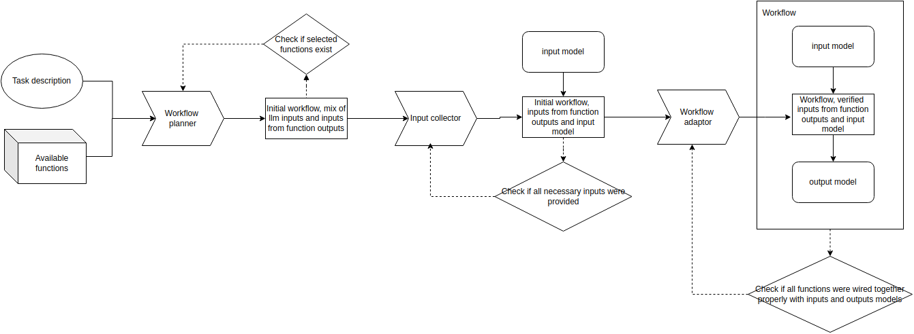

# Adaptive reusables

This repository contains attempts at creating a workflow auto assembler. The purpose of the workflow is to assemble a function based on available tools for a given prompt, where llm would not code anything directly, but instead returned workflow that consists of available tools connected though wiring their input/output models. 

